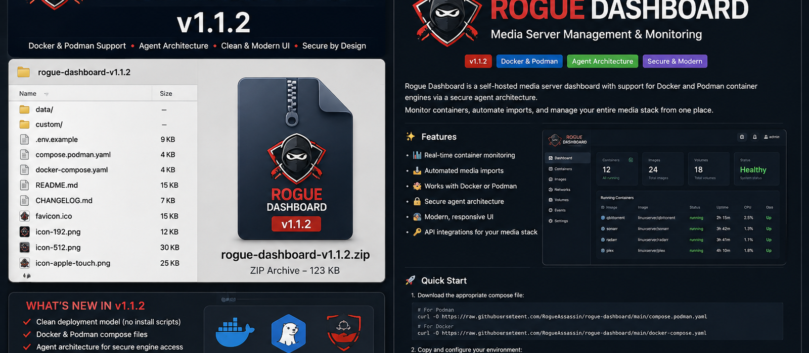

<div align="center">



# Rogue Dashboard

**A local-first Docker and Podman command centre.**

**Version 1.1.2** · GHCR deployment · Docker + Podman · Restricted engine agent

</div>

Rogue Dashboard provides a responsive dashboard for media and infrastructure services while keeping direct container-engine access behind a private restricted agent.

## 1.1.2 highlights

- Fixes the dashboard/agent startup separation: **only the engine agent requires the Docker or Podman socket**.
- Clean GHCR deployment model: no Linux install, migration or upgrade shell scripts.
- Two production manifests only: `docker-compose.yaml` and `compose.podman.yaml`.
- Native Podman socket support using `/run/podman/podman.sock` with no Docker compatibility symlink.
- Docker support using `/var/run/docker.sock` only inside the restricted engine agent.
- Synchronized Rogue Dashboard branding across the README, website header, loading/setup views, browser favicon, Apple touch icon and PWA icons.
- Updated 1.1.2 release artwork under `docs/assets/release/`.
- Preserves `.env`, `data/` and `custom/` between upgrades.

## Runtime folder

A deployed server only needs:

```text
rogue-dashboard/
├── .env
├── compose.podman.yaml       # Podman
# or docker-compose.yaml      # Docker
├── data/
└── custom/
```

The application itself is pulled from:

```text
ghcr.io/rogueassassin/rogue-dashboard:1.1.2
```

## Podman quick start

```bash
mkdir -p rogue-dashboard/data rogue-dashboard/custom
cd rogue-dashboard
curl -fsSLO https://raw.githubusercontent.com/RogueAssassin/rogue-dashboard/main/compose.podman.yaml
curl -fsSL https://raw.githubusercontent.com/RogueAssassin/rogue-dashboard/main/.env.example -o .env
# edit .env and set CONTAINER_AGENT_TOKEN
sudo systemctl enable --now podman.socket
sudo podman network inspect media-net >/dev/null 2>&1 || sudo podman network create media-net
sudo chown -R 10001:10001 data
sudo podman-compose --env-file .env -f compose.podman.yaml pull
sudo podman-compose --env-file .env -f compose.podman.yaml up -d
```

## Docker quick start

```bash
mkdir -p rogue-dashboard/data rogue-dashboard/custom
cd rogue-dashboard
curl -fsSLO https://raw.githubusercontent.com/RogueAssassin/rogue-dashboard/main/docker-compose.yaml
curl -fsSL https://raw.githubusercontent.com/RogueAssassin/rogue-dashboard/main/.env.example -o .env
# edit .env and set CONTAINER_AGENT_TOKEN
docker network inspect media-net >/dev/null 2>&1 || docker network create media-net
docker compose --env-file .env -f docker-compose.yaml pull
docker compose --env-file .env -f docker-compose.yaml up -d
```

## Updating

Podman:

```bash
sudo podman-compose --env-file .env -f compose.podman.yaml pull
sudo podman-compose --env-file .env -f compose.podman.yaml up -d
```

Docker:

```bash
docker compose --env-file .env -f docker-compose.yaml pull
docker compose --env-file .env -f docker-compose.yaml up -d
```

No Git checkout is required on the server.

## Architecture

```text
Browser
   ↓
Rogue Dashboard web container
   ↓ private HTTP + CONTAINER_AGENT_TOKEN
Restricted engine-agent
   ↓
Docker socket OR Podman socket
```

The browser and web dashboard container never receive the engine socket directly.

## Branding assets

The synchronized 1.1.2 identity is stored in:

- `docs/assets/hero.png` — README hero
- `docs/assets/rogue-dashboard-logo.png` — master documentation logo
- `docs/assets/release/rogue-dashboard-1.1.2-release.png` — release artwork
- `app/static/rogue-dashboard-logo.png` — website logo
- `app/static/favicon.ico`, `favicon-16x16.png`, `favicon-32x32.png`
- `app/static/apple-touch-icon.png`
- `app/static/icon-192.png`, `icon-512.png`, `site.webmanifest`

See [`docs/INSTALLATION.md`](docs/INSTALLATION.md), [`docs/CONFIGURATION.md`](docs/CONFIGURATION.md), [`docs/SECURITY.md`](docs/SECURITY.md) and [`docs/RELEASE_1.1.2.md`](docs/RELEASE_1.1.2.md).
