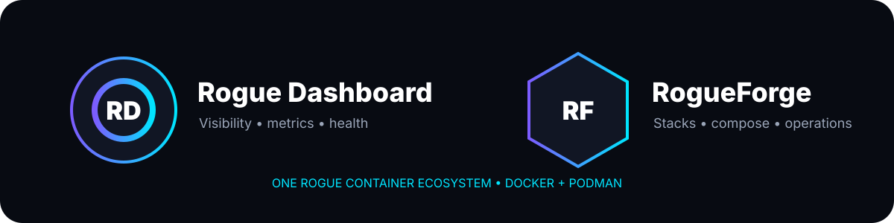

<div align="center">


# Rogue Dashboard

**A colourful, local-first command centre for Docker and Podman containers.**

[](https://github.com/RogueAssassin/rogue-dashboard)
[](docs/CONTAINER_ENGINES.md)
[](https://github.com/RogueAssassin/rogue-dashboard/pkgs/container/rogue-dashboard)
[](docs/SUPPORT.md)

Version **1.1.0** · Docker + Podman · Browser-based setup · No frontend build step

</div>

Rogue Dashboard turns a Docker or Podman host into an approachable control panel. It combines service links, live application metrics, container health, safe lifecycle controls, themes, search, pages and configuration in one responsive interface. The host does not need Node.js, TypeScript, pnpm or a frontend toolchain.

## 1.1.0 highlights

- **First-class Docker + Podman support** through an engine-neutral connection layer.
- **Native Podman socket** support at `/run/podman/podman.sock`; no `/var/run/docker.sock` compatibility symlink is required on Podman-only hosts.
- `CONTAINER_ENGINE=auto|docker|podman`, `CONTAINER_SOCKET`, and engine-neutral agent settings.
- Backward-compatible `DOCKER_*` environment aliases for existing installations.
- Dedicated `compose.podman.yaml` deployment path.
- Existing restricted-agent security boundary retained: the browser never receives direct engine socket access.

## Why Rogue Dashboard?

| | What you get |
| --- | --- |
| 🎨 | **Make it yours** — six colour presets, dual accents, neon glow, card opacity, density and custom backgrounds. |
| 📦 | **See containers clearly** — discover containers, networks, state and health with duplicate-safe dashboard cards. |
| ⚡ | **Live service data** — qBittorrent, Radarr, Sonarr, Prowlarr, Seerr, Bazarr, Tautulli and Pi-hole integrations. |
| 🧩 | **Edit in the browser** — add cards, rearrange groups, change columns and preview changes live. |
| 🗂️ | **Focused pages** — separate media, infrastructure, networking and links. |
| 🛡️ | **Restricted engine boundary** — only allow-listed metadata and lifecycle calls are proxied through the private agent. |
| 🔐 | **Local administration** — sessions, revocation, local action history and no cloud account requirement. |
| 🚚 | **Simple upgrades** — keep `.env`, `data/` and `custom/` while replacing the application image. |

## Install / test

### Requirements

Use either:

- Docker Engine with Docker Compose v2, or
- Podman with `podman-compose` and the Podman API socket.

Linux and WSL 2 are supported host environments. See [Support](docs/SUPPORT.md) for the tested baseline.

### Podman

```dotenv
CONTAINER_ENGINE=podman
CONTAINER_SOCKET=/run/podman/podman.sock
RGDASH_IMAGE=ghcr.io/rogueassassin/rogue-dashboard:1.1.0
```

Use:

```bash
podman-compose --env-file .env -f compose.podman.yaml up -d
```

### Docker

```dotenv
CONTAINER_ENGINE=docker
CONTAINER_SOCKET=/var/run/docker.sock
RGDASH_IMAGE=ghcr.io/rogueassassin/rogue-dashboard:1.1.0
```

Use:

```bash
docker compose up -d
```

`CONTAINER_ENGINE=auto` probes the mounted engine API socket. Legacy `DOCKER_SOCKET`, `DOCKER_AGENT_URL`, and `DOCKER_AGENT_TOKEN` remain accepted during the 1.1 transition.

Open `http://localhost:7805` after startup.

## Architecture

The same image runs in two modes:

- **dashboard** — browser UI, authentication, SQLite persistence, service widgets and monitoring.
- **engine-agent** — internal-only allow-listed engine metadata and container lifecycle operations.

The dashboard service does **not** mount the Docker or Podman socket. Only the restricted agent does.

See [Architecture](docs/ARCHITECTURE.md) and [Container Engines](docs/CONTAINER_ENGINES.md).

## Rogue ecosystem

Rogue Dashboard is the visibility and service-dashboard layer. **RogueForge** is the companion Docker/Podman stack-management project, designed with the same Midnight/Neon visual language for compose editing, stack lifecycle, logs, updates, networks and volumes.



The two applications are separate by design: Dashboard stays narrow and safe, while RogueForge handles privileged stack-management workflows.

## Persistent data

Keep these when upgrading:

| Path | Purpose |
| --- | --- |
| `.env` | Runtime settings and integration credentials |
| `data/` | SQLite database, users, sessions and dashboard layout |
| `custom/` | Local icons and backgrounds |
| `backups/` | Upgrade backups, when enabled |

Never replace a populated `.env` with `.env.example` during an upgrade.

## Documentation

- [Container engines](docs/CONTAINER_ENGINES.md)
- [Installation and networking](docs/INSTALLATION.md)
- [Configuration reference](docs/CONFIGURATION.md)
- [Reverse proxy guide](docs/REVERSE_PROXY.md)
- [Upgrading and recovery](docs/UPGRADING.md)
- [Security model](docs/SECURITY.md)
- [Architecture](docs/ARCHITECTURE.md)
- [Deployment guide](docs/DEPLOYMENT_GUIDE.md)
- [Migration policy](docs/MIGRATIONS.md)
- [Support matrix](docs/SUPPORT.md)
- [Changelog](CHANGELOG.md)
- [1.1.0 release notes](docs/RELEASE_1.1.0.md)
- [Roadmap](docs/ROADMAP.md)
- [Brand assets](docs/BRANDING.md)

## Local validation before publishing

```bash
python -m unittest discover -s tests -v
python -m compileall -q app
sh -n install.sh migrate-env.sh upgrade.sh scripts/validate-release.sh
sh scripts/validate-release.sh
```

Validate the relevant Compose deployment too:

```bash
docker compose -f docker-compose.yaml config
# or
podman-compose --env-file .env -f compose.podman.yaml config
```

## Contributing

The browser interface is plain HTML, CSS and JavaScript served by Python. There is no Node-based build step. Keep changes dependency-light, local-first and compatible with the restricted-agent security model.

## Acknowledgements

Rogue Dashboard is an original implementation shaped by useful ideas from several self-hosted dashboard projects. See [Third-party inspiration](THIRD_PARTY_INSPIRATION.md). Product names and trademarks belong to their respective owners.
