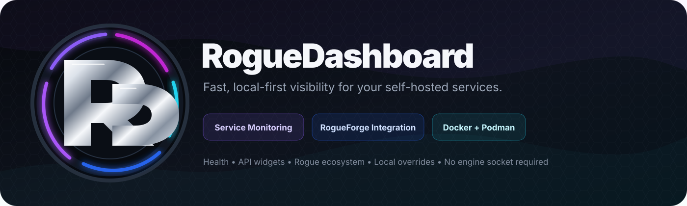

<div align="center">




</div>

RogueDashboard is a fast, local-first homepage and service-monitoring dashboard for self-hosted Docker and Podman environments. It gives you a clean view of your services, health, latency and application metrics without mounting the Docker or Podman engine socket.

RogueDashboard is designed to complement **[RogueForge](https://github.com/RogueAssassin/RogueForge)**. Use RogueDashboard for visibility and service monitoring; use RogueForge when you want full Docker/Podman stack and container management.

## What RogueDashboard does

- Displays your self-hosted services in configurable pages and groups.
- Checks private HTTP/HTTPS health endpoints and shows live latency.
- Collects lightweight application metrics from supported services.
- Keeps API keys and secrets server-side through `RGDASH_*` environment variables.
- Stores dashboard configuration, accounts and sessions in SQLite.
- Supports Docker and Podman from one engine-neutral `compose.yaml`.
- Runs without a Docker/Podman socket or privileged container-engine access.
- Supports remote-first service artwork with local `/custom/icons` overrides.
- Includes native RogueForge monitoring for version, engine, stack and container summaries.
- Uses a responsive, low-overhead interface designed to stay lightweight on media and home servers.

## Supported live integrations

RogueDashboard includes native collectors for:

```text
qBittorrent
Prowlarr
Radarr
Sonarr
Seerr
Bazarr
Tautulli
Pi-hole
RogueForge
```

Other services can still be added as normal health-checked cards.

## Rogue ecosystem

### RogueDashboard

Visibility, service health, latency, application widgets and your day-to-day self-hosted homepage.

### RogueForge

For full Docker/Podman container and Compose-stack management, install RogueForge alongside RogueDashboard:

**[Download / view RogueForge on GitHub](https://github.com/RogueAssassin/RogueForge)**

Both applications can share the same `media-net` network. RogueDashboard can then read RogueForge's lightweight status APIs without receiving Docker/Podman socket access or RogueForge administrator credentials.

## Container images

Production:

```text
ghcr.io/rogueassassin/roguedashboard:1.3.0
```

Latest stable:

```text
ghcr.io/rogueassassin/roguedashboard:latest
```

Testing:

```text
ghcr.io/rogueassassin/roguedashboard:testing
```

## Runtime layout

A normal installation only needs:

```text
roguedashboard/
├── .env
├── compose.yaml
├── data/
└── custom/
```

- `.env` — persistent `RGDASH_*` configuration and integration secrets.
- `data/` — SQLite database and application state.
- `custom/` — optional local icons and artwork overrides.
- `compose.yaml` — the same deployment definition for Docker or Podman.

## Install with Podman

```bash
mkdir -p /opt/media-server/roguedashboard/{data,custom}
cd /opt/media-server/roguedashboard

curl -fsSL https://raw.githubusercontent.com/RogueAssassin/RogueDashboard/main/compose.yaml -o compose.yaml
curl -fsSL https://raw.githubusercontent.com/RogueAssassin/RogueDashboard/main/.env.example -o .env

podman network inspect media-net >/dev/null 2>&1 || podman network create media-net
podman compose --env-file .env -f compose.yaml pull
podman compose --env-file .env -f compose.yaml up -d
```

## Install with Docker

```bash
mkdir -p /opt/roguedashboard/{data,custom}
cd /opt/roguedashboard

curl -fsSL https://raw.githubusercontent.com/RogueAssassin/RogueDashboard/main/compose.yaml -o compose.yaml
curl -fsSL https://raw.githubusercontent.com/RogueAssassin/RogueDashboard/main/.env.example -o .env

docker network inspect media-net >/dev/null 2>&1 || docker network create media-net
docker compose --env-file .env -f compose.yaml pull
docker compose --env-file .env -f compose.yaml up -d
```

## Updating without losing settings

Keep your existing `.env`, `data/` and `custom/` directories. Do not overwrite an existing `.env` with `.env.example`.

Podman:

```bash
cd /opt/media-server/roguedashboard
curl -fsSL https://raw.githubusercontent.com/RogueAssassin/RogueDashboard/main/compose.yaml -o compose.yaml
podman compose --env-file .env -f compose.yaml pull
podman compose --env-file .env -f compose.yaml up -d
```

Docker:

```bash
cd /opt/roguedashboard
curl -fsSL https://raw.githubusercontent.com/RogueAssassin/RogueDashboard/main/compose.yaml -o compose.yaml
docker compose --env-file .env -f compose.yaml pull
docker compose --env-file .env -f compose.yaml up -d
```

Existing settings, users, pages, groups, integrations and custom artwork remain persistent. Older `data/rogue-dashboard.sqlite` databases are migrated to `data/roguedashboard.sqlite`.

## RogueForge card

When RogueForge shares the same container network, create a card with:

```text
Name: RogueForge
Open URL: https://manage.example.com
Live integration: RogueForge
Private API URL: http://rogueforge:7810
Private health URL: http://rogueforge:7810/health
Icon: rogueforge
```

The card can display RogueForge version, container engine, running/total stacks and running/total containers.

## Branding and icons

RogueDashboard has its own interlocked **RD** identity while staying visually aligned with the wider Rogue ecosystem.

```text
app/static/branding/
├── roguedashboard.svg
├── roguedashboard-dark.svg
├── roguedashboard-light.svg
└── branding-switch.js

app/static/icons/
└── roguedashboard.svg
```

Core RogueDashboard branding is bundled and versioned with the application. Service-card artwork can still use GitHub-hosted assets or local overrides.

Icon resolution:

1. local `/custom/icons` override,
2. configured HTTPS/GitHub asset,
3. bundled fallback,
4. initials fallback.

## Architecture

```text
Browser
  ↓
RogueDashboard
  ├─ HTTP/HTTPS health probes
  ├─ API widget collectors
  ├─ SQLite configuration
  └─ RogueForge read-only status integration

RogueForge
  └─ Docker / Podman stack and container management
```

This separation keeps RogueDashboard fast and avoids giving a homepage unnecessary control over the container engine.

## Testing channel

Development is validated through the `testing` branch. Successful CI publishes:

```text
ghcr.io/rogueassassin/roguedashboard:testing
ghcr.io/rogueassassin/roguedashboard:1.3.0-testing
```

The pipeline runs application tests, Python validation, Compose validation, an amd64 build and a multi-architecture amd64/arm64 publish.

See [docs/TESTING.md](docs/TESTING.md).

## License

MIT
