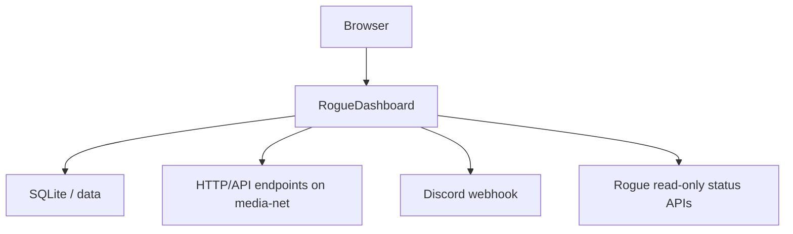

# Architecture

RogueDashboard is the lightweight monitoring layer of the Rogue ecosystem. It is a Python service with a dependency-free browser frontend and does not mount a Docker or Podman socket.

## Responsibilities

| Component | Responsibility |
| --- | --- |
| RogueDashboard | UI, authentication, SQLite state, health monitoring, incidents, Discord and read-only integrations |
| RogueForge | Docker/Podman stack management, updates, logs and terminals |
| RogueMediaValidator | Torrent/media validation and protection |
| RogueRoute-GPX | Routing and GPX services |

Keeping monitoring separate from engine management gives RogueDashboard a smaller privilege and resource footprint.

## Data flow

## Source layout

- `app/dashboard.py` — HTTP API, sessions, SQLite, health monitoring and incidents
- `app/integrations.py` — server-side integration collectors
- `app/importer.py` and `app/homepage_yaml.py` — dashboard imports
- `app/static/` — HTML, CSS, JavaScript and bundled icons
- `custom/` — administrator-provided icons/backgrounds
- `compose.yaml` — shared Docker/Podman deployment
- `update.sh` — shared Docker/Podman updater

## Persistence and secrets

SQLite uses the bind-mounted `data/` directory. Integration credentials and Discord secrets remain in server-side `RGDASH_*` environment variables and are not returned in dashboard exports.
