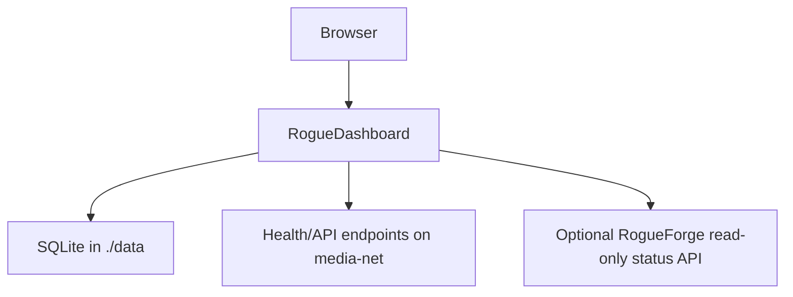

# Architecture

RogueDashboard is a lightweight, engine-neutral Python service with a dependency-free browser frontend. It monitors configured HTTP endpoints and service APIs without mounting the Docker or Podman socket.

## Runtime

| Component | Responsibility |
| --- | --- |
| `roguedashboard` | UI, local authentication, SQLite persistence, service health probes, API widgets, imports and administration |
| `RogueForge` | Optional companion for Docker/Podman stack and container management |

RogueDashboard deliberately does not manage the container engine. Container lifecycle, logs, Compose stacks and privileged engine access belong in RogueForge.

## Data flow

## Source layout

- `app/dashboard.py` — HTTP API, SQLite storage, sessions, validation and endpoint health monitoring.
- `app/integrations.py` — server-side service API collectors.
- `app/importer.py` / `app/homepage_yaml.py` — safe dashboard imports.
- `app/static/` — dependency-free HTML, CSS, JavaScript and built-in icons.
- `custom/` — persistent user icons and backgrounds.
- `compose.yaml` — unified Docker/Podman deployment.

## Persistence and secrets

SQLite uses WAL mode in the bind-mounted `data/` directory. Administrator passwords use scrypt with unique salts. Sessions are stored as hashes and expire according to application policy.

Integration credentials are read from `RGDASH_*` environment variables. Secret values are never returned to the browser or written into dashboard configuration exports.

## Monitoring boundary

Health checks target explicitly configured HTTP/HTTPS URLs. RogueDashboard does not mount Docker or Podman sockets and does not require privileged container-engine access. This keeps monitoring independent of the runtime while RogueForge handles privileged management as a separate trust boundary.
