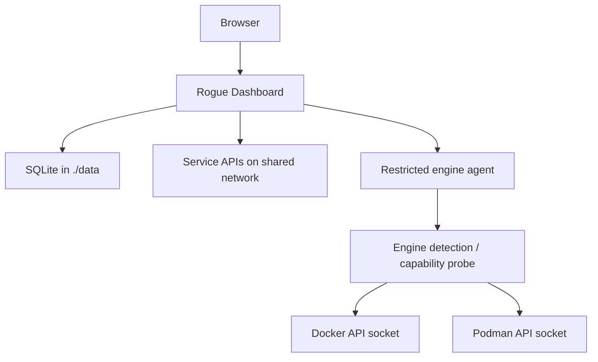

# Architecture

Rogue Dashboard 1.1 is an engine-neutral, standard-library Python application with a browser-native frontend. The same application image can run against Docker Engine or Podman through a restricted internal agent.

## Runtime services

| Service | Exposure | Responsibility |
| --- | --- | --- |
| `dashboard` | Host `${RGDASH_PORT:-7805}` → container `8080` | UI, authentication, imports, persistence, monitoring and integration clients |
| `engine-agent` | Internal `8081` only | Allow-listed container metadata and lifecycle operations against Docker or Podman |

The browser talks only to `dashboard`. The dashboard calls the agent over its private network with a generated bearer token. Only the agent mounts the selected engine API socket.

## Request and data flow

## Engine layer

`app/container_engine.py` detects and describes the connected runtime. New deployment configuration uses `CONTAINER_ENGINE`, `CONTAINER_SOCKET`, and `CONTAINER_AGENT_*`. Legacy `DOCKER_*` variables remain compatibility aliases during the 1.1 transition.

The initial cross-engine implementation deliberately keeps some historical internal `docker_*` function/route names so existing application behaviour and tests remain stable. Those names are implementation details, not a requirement for Docker Engine.

## Source layout

- `app/dashboard.py` — HTTP API, SQLite storage, sessions, validation, monitoring and restricted-agent mode.
- `app/container_engine.py` — Docker/Podman socket discovery, version probing and engine requests.
- `app/engine_entrypoint.py` — compatibility entrypoint that selects the engine before loading the dashboard runtime.
- `app/importer.py` / `app/homepage_yaml.py` — safe dashboard imports.
- `app/integrations.py` — server-side service API collectors.
- `app/static/` — dependency-free HTML/CSS/JavaScript and bundled icons.
- `custom/` — persistent user artwork, served read-only.
- `docker-compose.yaml` — Docker deployment.
- `compose.podman.yaml` — native Podman deployment.
- `docker-compose.build.yaml` — explicit development build override.

## Persistence and secrets

SQLite runs in write-ahead logging mode inside bind-mounted `data/`. Administrator passwords use `scrypt` with unique salts. Session tokens are random, stored as hashes and expire according to the application policy.

Integration credentials remain environment variables. Widget responses expose display metrics and safe diagnostics, never secret values.

## Restricted engine boundary

The engine agent exposes only the application-approved endpoints required for container discovery and confirmed lifecycle controls. There is no general Engine API passthrough, arbitrary command execution, image deletion API or browser-visible socket.

Container discovery returns a bounded metadata summary: identifier, name, image, state/health, ports, selected labels and attached networks. It does not expose container environment variables or secret values.

Docker and Podman both support the Docker-compatible API operations used by the 1.1 dashboard. Podman-specific features should be introduced behind capability checks rather than by branching the whole application.
